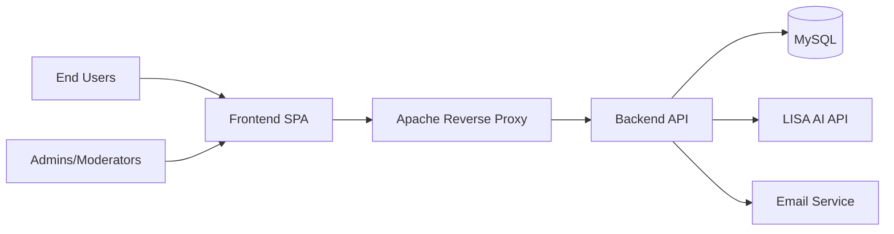
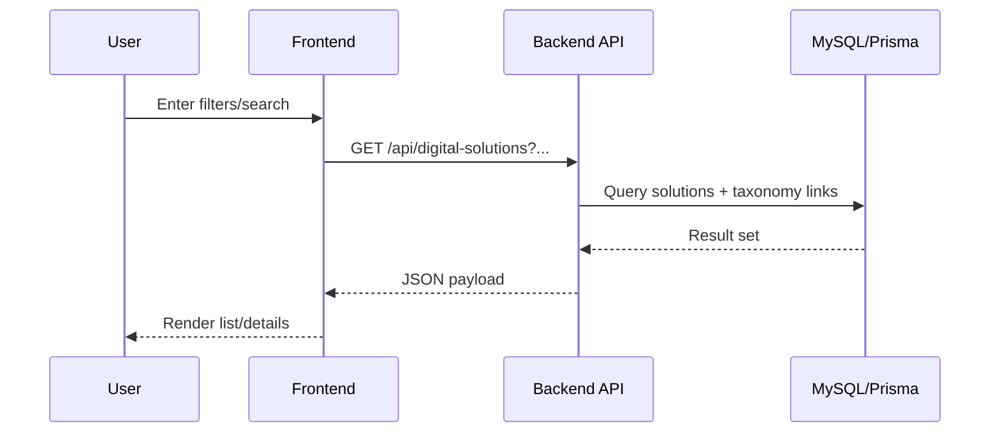
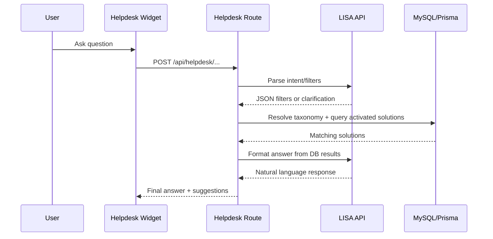
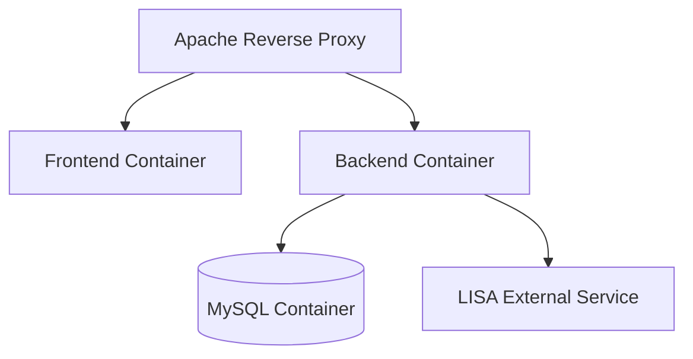

# System Design Document (SDD)

Version: 1.0  
Date: 2026-03-17  
Project: Dilowa (Digital Lotse Wasser)

## 1. Purpose

This document defines the high-level and logical architecture for Dilowa, including components, data flow, integrations, and interface boundaries.

## 2. Architecture Overview

Dilowa follows a web-based, service-oriented architecture:
- Frontend SPA (React + TypeScript + Vite) for user interaction.
- Backend REST API (Express + TypeScript) for business logic.
- MySQL database accessed via Prisma ORM.
- External integrations (LISA AI, SMTP/email).
- Docker Compose-based deployment with Apache reverse proxy.

### 2.1 System Context

## 3. Component Design

### 3.1 Frontend Components
- `pages/`: route-level page composition.
- `components/`: reusable UI building blocks.
- `services/`: API adapters (Axios-based).
- `context/`: auth/session and shared state.
- `i18n/`: translation and locale handling.
- `forms/` and `hooks/`: feature and state logic.

### 3.2 Backend Components
- `routes/`: endpoint declarations.
- `controllers/`: request orchestration.
- `services/`: domain logic (auth, taxonomy, solution, LISA, email).
- `middlewares/`: auth, permission checks, validation, error handling.
- `prisma/`: schema, migration, client access.
- `config/permissions/`: role navigation and resource permissions.

### 3.3 Data Layer Components
- MySQL as source of truth.
- Prisma models for:
  - Users, organizations, digital solutions.
  - Taxonomy nodes and mappings.
  - Expert videos.
  - Legal content and acceptance records.
  - Public PDFs and file metadata.

## 4. Logical Data Flow

### 4.1 Standard Catalog Search Flow

### 4.2 AI Helpdesk Flow (LISA)

## 5. Interface Design

### 5.1 External Interfaces
- `LISA API`:
  - Purpose: NLP understanding and response formatting.
  - Transport: HTTPS.
  - Auth: bearer token via env configuration.
- `SMTP/Email`:
  - Purpose: account and notification mails.
  - Transport: SMTP with credentials from environment.

### 5.2 Internal Interfaces
- Frontend-to-backend: REST JSON under `/api`.
- Backend-to-database: Prisma client calls.
- Authorization boundary: middleware enforces role/scoped permissions.

### 5.3 Key API Domains
- Auth: login/register/refresh/logout.
- Users and organizations.
- Digital solutions and taxonomy.
- Expert videos.
- Helpdesk chat.
- Policy and informational content.

## 6. Security Architecture

- JWT-based auth with access/refresh strategy.
- Server-side permission enforcement (`ADMIN`, `MODERATOR`, `USER`).
- Scoped ownership checks (`own` vs `others`) for sensitive actions.
- Environment-managed secrets for DB/API/email credentials.
- Conflict/error mapping for constrained operations.

## 7. Deployment Architecture

### 7.1 Environments
- Local development: Docker Compose dev profile.
- Production: Docker Compose prod profile + Apache reverse proxy.

### 7.2 Runtime Topology

### 7.3 Operational Considerations
- Health endpoint checks (`/api/health`).
- Logging for backend diagnostics.
- Persistent storage for uploads/public assets.
- DB migrations and seed scripts managed by Prisma and npm scripts.

## 8. Architectural Decisions (ADR Summary)

1. Use React SPA to accelerate feature development and i18n support.
2. Use Express + TypeScript for maintainable API and role-based middleware.
3. Use Prisma + MySQL for relational integrity and migration workflow.
4. Use Docker Compose for reproducible deployments.
5. Integrate LISA for domain-aware query interpretation and response quality.

## 9. Quality Attributes And Trade-Offs

- Maintainability: strong due to TypeScript and clear layering.
- Security: strong baseline via RBAC and server-side checks.
- Scalability: moderate, can be improved with caching and horizontal scaling.
- Availability: dependent on infrastructure and LISA external service uptime.
- Performance: acceptable for current scope; monitor AI-dependent latency paths.

## 10. Open Design Items

1. Define target SLOs per API domain (beyond health endpoint).
2. Add centralized metrics/alerting for production observability.
3. Decide fallback behavior and UX for LISA outage scenarios.
4. Formalize backup/restore RTO and RPO targets.
